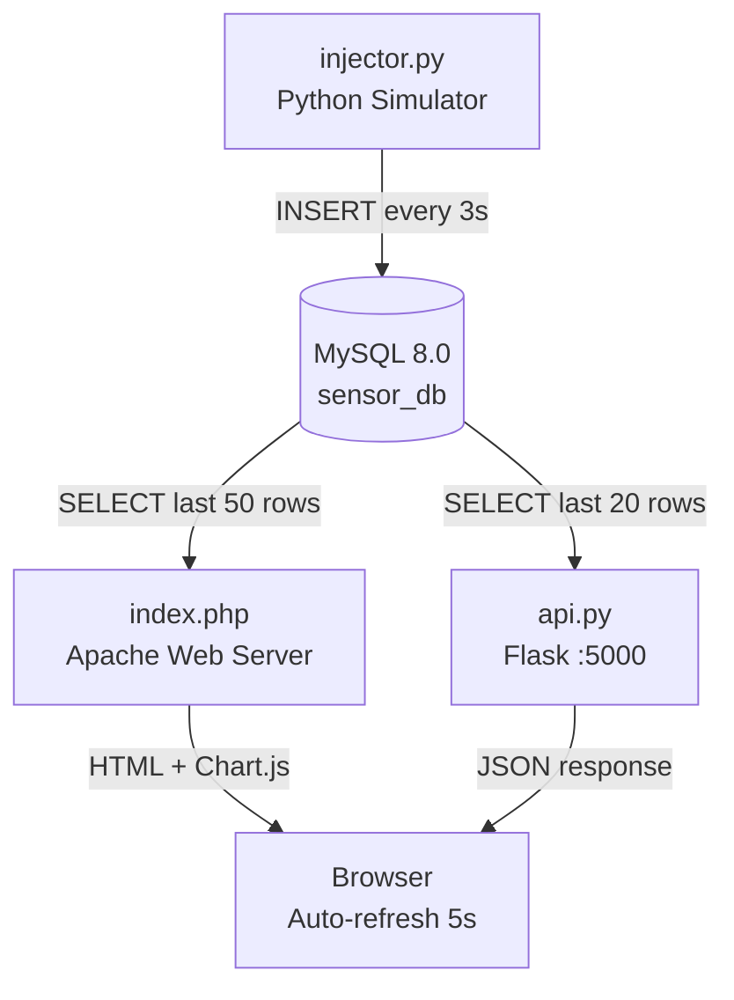

# Process Documentation

## What Was Built

A **Smart Factory Virtual Sensor Monitoring System** — a fully simulated IoT dashboard using a LAMP stack and Flask on Ubuntu 24.04. No physical hardware is required; all sensor readings are generated by a Python script.

### Components

| File | Role |
|------|------|
| `db_setup.sh` | Creates MySQL user and database |
| `setup.sql` | Creates the `sensor_data` table and inserts sample data |
| `injector.py` | Simulates 3 sensors, inserts a reading every 3 seconds |
| `api.py` | Flask REST API on port 5000 |
| `index.php` | PHP dashboard served by Apache with Chart.js |

---

## Setup Steps (in order)

### 1. Install prerequisites
```bash
sudo apt update
sudo apt install -y apache2 mysql-server php php-mysqli libapache2-mod-php python3 python3-pip
pip3 install flask flask-cors mysql-connector-python
```

### 2. Run database setup
```bash
chmod +x db_setup.sh
./db_setup.sh
```

### 3. Create the table and load sample data
```bash
mysql -u sensor_user -psensor_pass sensor_db < setup.sql
```

### 4. Deploy the PHP dashboard to Apache
```bash
sudo cp index.php /var/www/html/index.php
sudo systemctl restart apache2
```

### 5. Start the sensor data injector
```bash
python3 injector.py
```

### 6. Start the Flask API (separate terminal)
```bash
python3 api.py
```

### 7. Open the dashboard
- PHP dashboard: http://localhost/
- Flask API data: http://localhost:5000/api/data
- Flask API latest: http://localhost:5000/api/latest
- Flask API health: http://localhost:5000/api/health

---

## System Architecture


