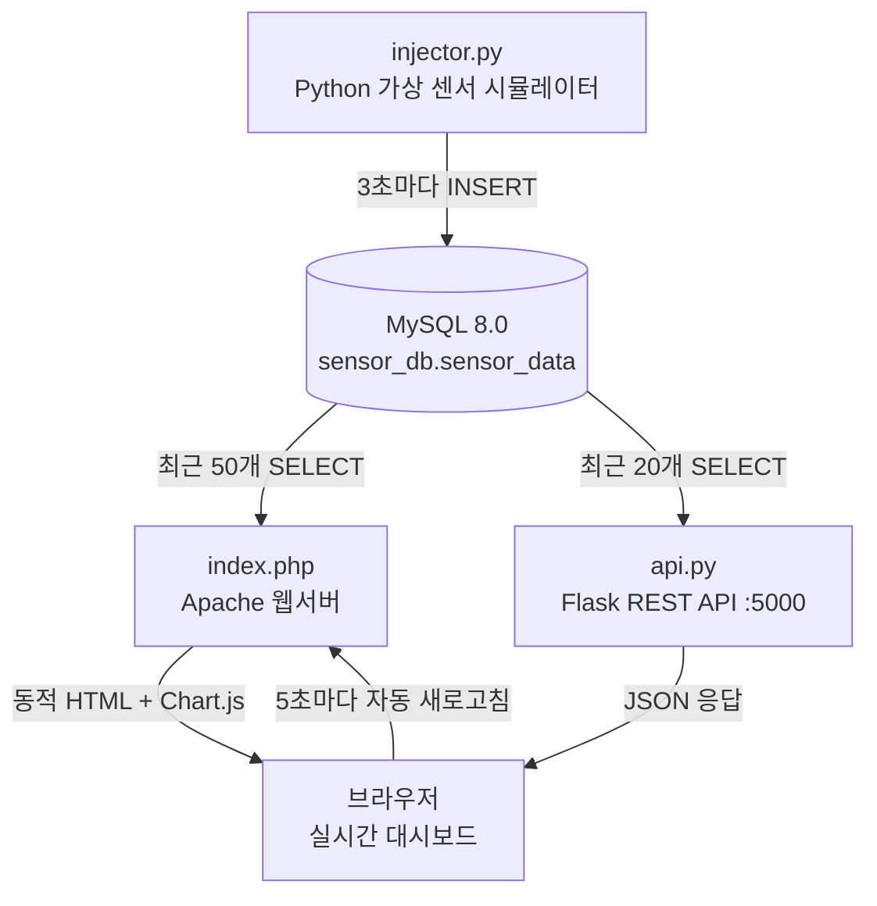

# 구축 과정 문서

## 구축 내용

Ubuntu 24.04 환경에서 LAMP 스택과 Flask를 활용한 **스마트 팩토리 가상 센서 모니터링 시스템**입니다.
물리적인 센서 장비 없이 Python 스크립트가 데이터를 생성하며, 웹 대시보드에서 실시간으로 시각화합니다.

---

## 구성 파일 목록

| 파일 | 역할 |
|------|------|
| `db_setup.sh` | MySQL 사용자 및 데이터베이스 생성 |
| `setup.sql` | `sensor_data` 테이블 생성 및 샘플 데이터 삽입 |
| `injector.py` | 3개 가상 센서 시뮬레이션, 3초마다 데이터 삽입 |
| `api.py` | Flask REST API 서버 (포트 5000) |
| `index.php` | Apache를 통해 제공되는 PHP + Chart.js 대시보드 |
| `install.sh` | Python 및 PHP 의존성 패키지 설치 |

---

## 설치 및 실행 순서

### 1단계. 시스템 패키지 설치
```bash
sudo apt update
sudo apt install -y apache2 mysql-server php php-mysqli libapache2-mod-php python3 python3-pip
```

### 2단계. Python 및 PHP 의존성 설치
```bash
./install.sh
```
또는 직접 실행:
```bash
sudo apt install php-mysqli -y
pip3 install mysql-connector-python flask flask-cors --break-system-packages
```

### 3단계. 데이터베이스 설정
```bash
chmod +x db_setup.sh
./db_setup.sh
```

### 4단계. 테이블 생성 및 샘플 데이터 삽입
```bash
mysql -u sensor_user -pSensor@1234 sensor_db < setup.sql
```

### 5단계. PHP 대시보드를 Apache에 배포
```bash
sudo cp index.php /var/www/html/index.php
sudo systemctl restart apache2
```

### 6단계. 가상 센서 데이터 주입기 실행
```bash
python3 injector.py
```

### 7단계. Flask API 서버 실행 (별도 터미널)
```bash
python3 api.py
```

### 8단계. 브라우저에서 확인
- PHP 대시보드: http://localhost/
- Flask API 전체 데이터: http://localhost:5000/api/data
- Flask API 센서별 최신값: http://localhost:5000/api/latest
- Flask API 상태 확인: http://localhost:5000/api/health

---

## 시스템 아키텍처


