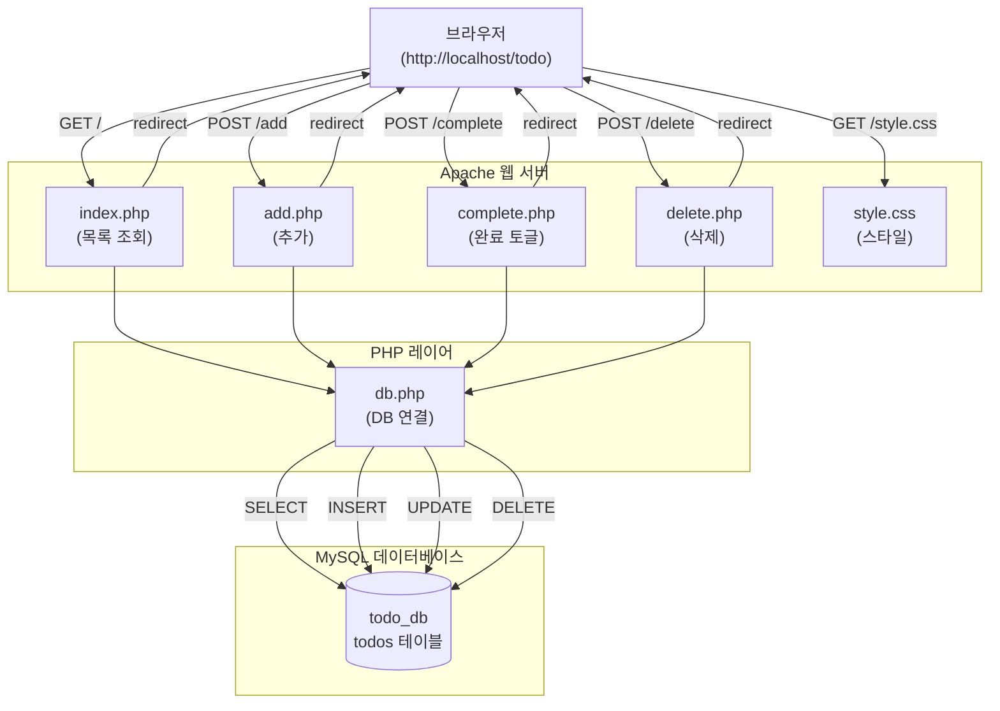

# Todo 일정관리 앱 프로젝트

## 프로젝트 개요

LAMP 스택(Linux + Apache + MySQL + PHP)을 기반으로 구축한 웹 기반 Todo 일정관리 애플리케이션입니다.
사용자는 브라우저에서 할 일을 추가·조회·완료 체크·삭제할 수 있습니다.

---

## 사용 기술 스택

| 레이어 | 기술 |
|--------|------|
| OS | Linux (Ubuntu) |
| 웹 서버 | Apache2 |
| 데이터베이스 | MySQL |
| 백엔드 | PHP |
| 프론트엔드 | HTML5 / CSS3 |

---

## 주요 기능 목록

- **추가(Add)** : 할 일 제목을 입력하여 새로운 항목을 등록합니다.
- **조회(List)** : 등록된 모든 할 일을 최신순으로 목록에 표시합니다.
- **완료 체크(Complete)** : 항목을 클릭하여 완료 상태로 전환합니다. (토글 방식)
- **삭제(Delete)** : 불필요한 항목을 목록에서 영구 삭제합니다.

---

## 파일 구조

```
/var/www/html/todo/
├── index.php      # 메인 페이지 (목록 조회)
├── db.php         # MySQL 연결 설정
├── add.php        # 할 일 추가 처리
├── complete.php   # 완료 상태 토글 처리
├── delete.php     # 할 일 삭제 처리
└── style.css      # UI 스타일시트

/home/lsj/project/
├── project.md     # 프로젝트 문서
└── setup.sql      # DB 초기화 스크립트
```

---

## Mermaid 시스템 흐름도


